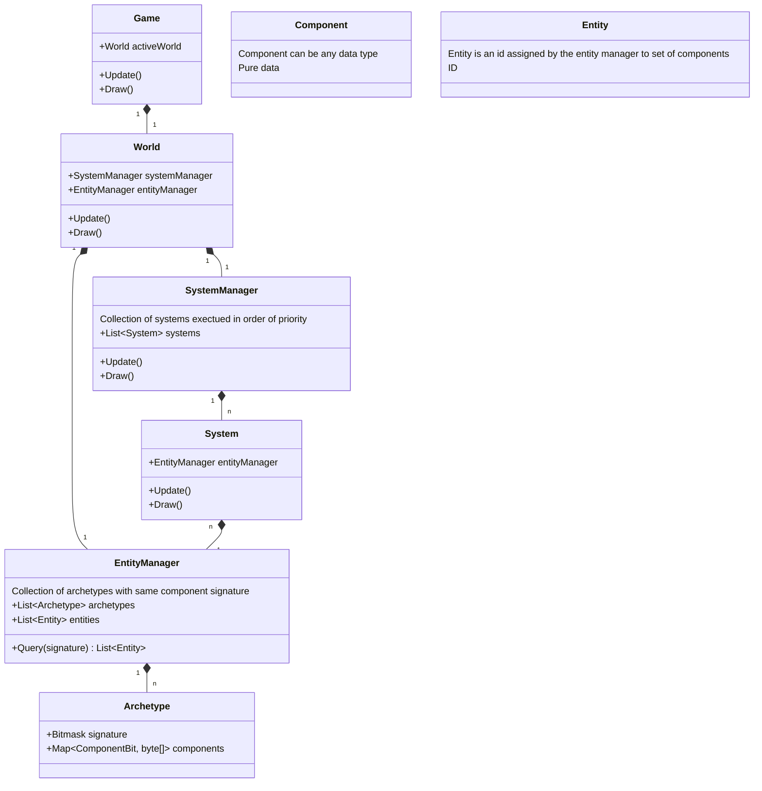
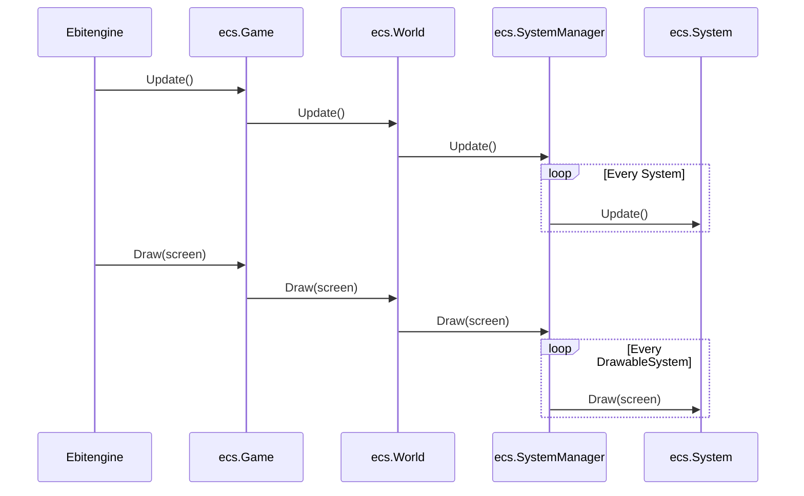

# Game Engine (ECS-based)

This is an ECS-based game engine built with Go, using [Ebitengine](https://ebitengine.org/) for rendering/input and [Chipmunk2D](https://github.com/jakecoffman/cp) for physics.

## Quick Start
- **Run Game**: `go run cmd/game/main.go`
- **Run Tests**: `go test ./...`

## Architecture
The engine follows a strict **Entity-Component-System (ECS)** architecture.

### Library Overview


### Engine Lifecycle (Ebiten Integration)


- **`ecs`**: Core framework (World, EntityManager, SystemManager, Registry).
- **`game/components`**: Pure data structures.
- **`game/systems`**: Logic processors that operate on component queries.
- **`game/assets`**: TOML-based entity templates and world configurations.

## Key Developer Patterns

### 1. Registration (CRITICAL)
All components and systems **must** be registered in their package `init()` functions to enable dynamic loading from TOML.
```go
// in game/components/my_component.go
func init() {
    ecs.RegisterComponent[MyComponent]()
}

// in game/systems/my_system.go
func init() {
    ecs.RegisterSystem(NewMySystem)
}
```

### 2. Querying Entities
Use `ecs.Query` variants to iterate entities with specific component signatures.
```go
for entity := range ecs.Query[components.Transform](em) {
    transform := ecs.MustGetComponent[components.Transform](em, entity)
    // Perform logic
}
```
Hooks: Use `ecs.Query2`, `ecs.Query3`, etc., for multi-component requirements.

### 3. Data-Driven Workflow
- **Entities**: Defined in `game/assets/Entities/*.toml`. 
- **Worlds**: Defined in `game/assets/Worlds/*.toml`. Worlds list systems and entities to instantiate on load.
- **Overwrites**: World TOMLs can specify component values that overwrite the defaults in the entity template.

### 4. Physics Integration
Physics uses [Chipmunk2D](github.com/jakecoffman/cp). `RigidBody` and `Collider` components are the bridge between ECS and the physics engine.

## Directory Map
- [cmd/game/](file:///e:/game/cmd/game): Application entry point and initialization.
- [ecs/](file:///e:/game/ecs): Core ECS implementation (Archetypes, Filters, Registry).
- [game/components/](file:///e:/game/game/components): Component definitions.
- [game/systems/](file:///e:/game/game/systems): System implementations.
- [game/assets/](file:///e:/game/game/assets): World (`Worlds/`), Entity (`Entities/`), and Image (`Sprites/`) assets.
- [game/entities/](file:///e:/game/game/entities): Factory functions for complex entities.

## Testing Patterns
- Use `testify/assert` and `testify/require`.
- Register test components in `init()` within `*_test.go` if they are mock-only.
- See [ecs/entity_test.go](file:///e:/game/ecs/entity_test.go) for query and benchmark examples.
